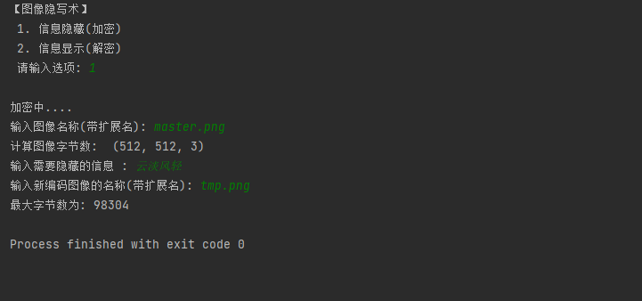
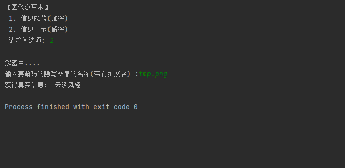

# python脚本-图像隐写术

## 安装所需库

### 在线安装
```
pip install opencv-python
```

若遇到网络超时，可改用国内源

```
# 临时生效
pip install opencv-python -i http://mirrors.aliyun.com/pypi/simple/ --trusted-host mirrors.aliyun.com

# 永久生效
pip config set global.index-url http://mirrors.aliyun.com/pypi/simple/
pip config set global.trusted-host mirrors.aliyun.com

pip install opencv-python
```

### 离线安装

某些情况下，会存在诸如版本错误或者编译失败的问题，直接离线下载官方已经编译好的whl包可完美解决

```
# 以opencv-python为例，在下面这个地址下载与自己环境python版本、操作系统版本对应的包

https://mirrors.aliyun.com/pypi/simple/opencv-python/
```


```
# 在whl包存放位置打开终端，执行以下命令

pip install .\opencv_python-3.4.0.12-cp36-cp36m-win32.whl

# 注：我的环境是windows10，python3.6.x
```

## 功能验证

- 图片


- 加密



- 解密



```python
#注意，因为中文字符占两个字节，所以加密过程中每个字符转换成二进制时都存放成16位
```