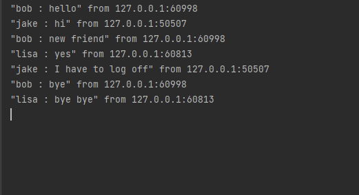
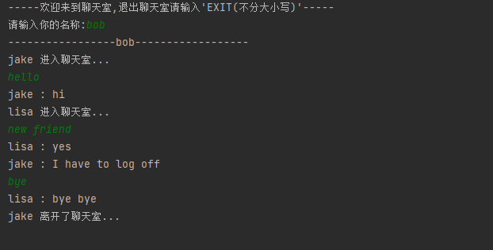
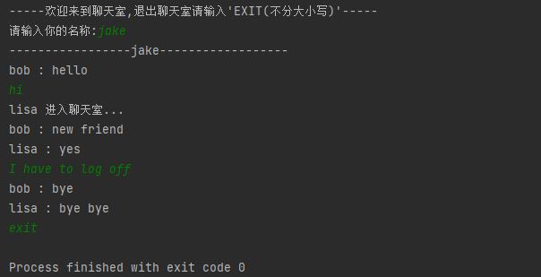
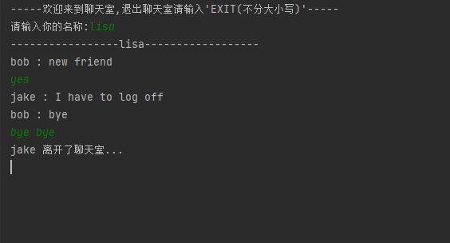

# python脚本-多人聊天室


## 函数接口
```
s = socket.socket (socket_family, socket_type, protocol = 0)
```

## 参数简介

|    参数   |  描述 |
| :-- | :-- |
|socket_family|它的值可以是：AF_UNIX或AF_INET|
|socket_type|它的值可以是：SOCK_STREAM或SOCK_DGRAM|
|protocol|这通常被省略，默认为0|


## 常用方法
|    方法   |  描述 |
| :-- | :-- |
|s.bind()|此方法将地址(主机名，端口号对)绑定到套接字|
|s.recvfrom()|此方法接收UDP消息，返回值是一对（字节， 地址） ，其中字节是代表接收到的数据的字节对象，而地址是发送数据的套接字的地址|
|s.sendto()|此方法发送UDP消息，将数据发送到套接字。该套接字不应连接到远程套接字，因为目标套接字是由address指定的|
|s.close()|此方法关闭套接字，套接字对象上所有以后的操作都将失败。远端将不再接收任何数据（在清除排队的数据之后）。套接字在被垃圾回收时会自动关闭|
|s.gethostname()|返回主机名，返回一个字符串，其中包含当前正在执行Python解释器的计算机的主机名|

代码来源：[https://www.cnblogs.com/huny/p/14051152.html](https://www.cnblogs.com/huny/p/14051152.html)


# 效果

- 服务端



- 客户端








