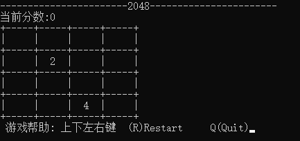
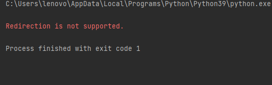

# python脚本-2048小游戏

- 图片



# 部署

- curses包

根据python版本下载对应的whl包

地址：[https://www.lfd.uci.edu/~gohlke/pythonlibs/#curses](https://www.lfd.uci.edu/~gohlke/pythonlibs/#curses)

```
例如：python3.9
curses-2.2.1+utf8-cp39-cp39-win_amd64.whl
```

- 命令
```python
pip install curses-2.2.1+utf8-cp39-cp39-win_amd64.whl
```

- 运行


```
不能用任何IDE来运行有curses包的python文件

改到命令行运行
```
